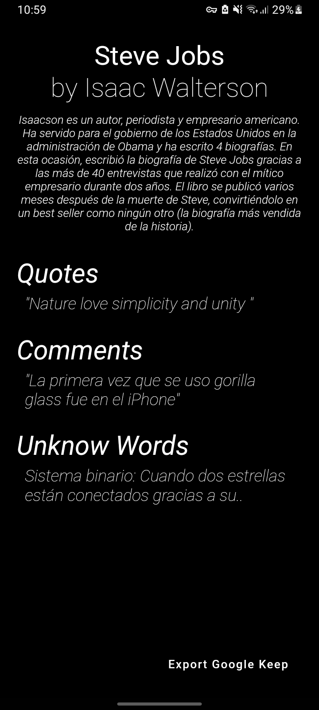
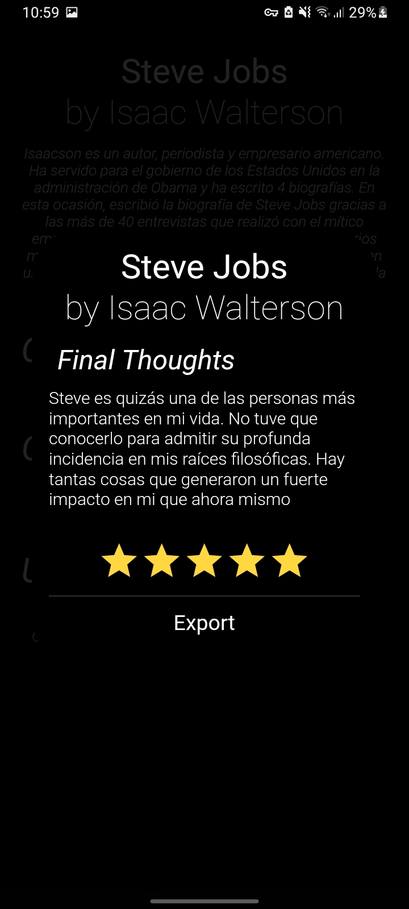

# ReaderDatabase
## _Tool for all reader's notes_

This app helps you to take, update, delete and read all your book's notes and
insights. Also, it helps you to have a unknow words list with their respective
definition. ReaderDatabase is clean, lightweight and easier to use.
Each book has a option to export in Google keep's format (something created by me that 
makes possible understand the difference between a note, unknow word and quote).

## _Dependencies_
- [Sqflite]: The database
- [Local_Auth]: To manage biometrics and pin authentication
- [Flutter_launcher_icons]
- And so son

## _Captures_

## _License_
[MIT]

[//]: #
    [MIT]: <./LICENSE>
    [Sqflite]: <https://pub.dev/packages/sqflite>
    [Local_Auth]: <https://pub.dev/packages/local_auth>
    [Flutter_launcher_icons]: <https://pub.dev/packages/flutter_launcher_icons>